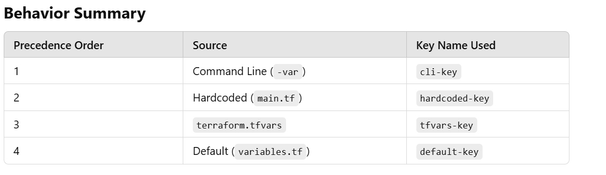

Topics discussed in today's class
1. significance of .tfvars
2. significance of output.tf
3. terraform plan -var or terraform apply -var
4. Determine which value to apply if the  value is defined in multiple places (e.g., main.tf, variables.tf, and terraform.tfvars)
5. terraform plan -var-file <filename> or terraform apply -var-file <filename>
6. terraform fmt
7. terraform validate
----------------------------------------------------------------------------------

In Terraform, variables can be defined in multiple places. When you specify values for variables in multiple places, Terraform applies a particular order of precedence to determine which value to use. Here's how the variable assignment works:

1. -var: When you provide a variable value directly on the command line using the -var flag, it has the highest precedence.

2. main.tf: If the variable is defined in main.tf (or any other Terraform configuration files), it gets used only if no value is specified via the -var flag.

3. -tfvars: If a .tfvars file is used, its values are applied after the command-line -var flag but before the variable.tf or main.tf.

4. variable.tf: This file contains the default values for the variables. If none of the other sources specify a value, the default value from variable.tf will be used.

Example:
Let’s say we have a variable named key_name:
1. main.tf:
    variable "key_name" {
    description = "Name of the key"
    }
2. variable.tf:
    variable "key_name" {
    default = "default-key" 
    }
3. myvars.tfvars:
    key_name = "tfvars-key"
4. Command line with -var:
    terraform apply -var "key_name=cli-key"

Precedence:
Command line (-var): cli-key (highest precedence)
.tfvars file (myvars.tfvars): tfvars-key
variable.tf: default-key
main.tf: No value specified, so it defaults to default-key

----------------------------------------------------------------------------------------------

terraform apply -var: The terraform apply -var= command is used to explicitly pass variables and their values directly on the command line when running terraform apply. This allows you to override values defined in terraform.tfvars, environment variables, or defaults in variables.tf.

Syntax: terraform apply -var="variable_name=value"
--------------------------------------------------------------------------------------

terraform apply -var-file: The terraform apply -var-file= command is used to pass a .tfvars file containing variable values to Terraform during the apply process. This method is particularly useful when managing multiple sets of variables for different environments (e.g., development, staging, production).
Syntax: terraform apply -var-file=<filename>

----------------------------------------------------------------------------------------

output.tf: The output.tf file in Terraform is used to define output values, which are values you want to display after applying your Terraform configuration. These values are helpful for sharing important information (like instance IDs, IP addresses, or DNS names) from your infrastructure setup.

Syntax:
output "<output_name>" {
  value       = <value>
  description = "<description>" # Optional
  sensitive   = <true/false>    # Optional
}

Example:
output "instance_public_ip" {
  value       = aws_instance.my_instance.public_ip
  description = "The public IP of the EC2 instance"
}

------------------------------------------------------------------------------------------
terraform fmt: terraform fmt is a command used in Terraform to automatically format your Terraform configuration files (e.g., *.tf files) according to the canonical style guidelines. This ensures that your code is consistent, readable, and adheres to a standard formatting style, improving maintainability and collaboration.

Command: terraform fmt

--------------------------------------------------------------------------------------------

terraform validate: terraform validate is a command in Terraform that checks whether your configuration files are syntactically valid and internally consistent, without actually applying or modifying any infrastructure. This command ensures that the Terraform files follow the correct structure, that the syntax is correct, and that the configuration is logically sound.

Command: terraform validate
-----------------------------------------------------------------------
Please refer to Understanding tfvars and output.docX file for more details